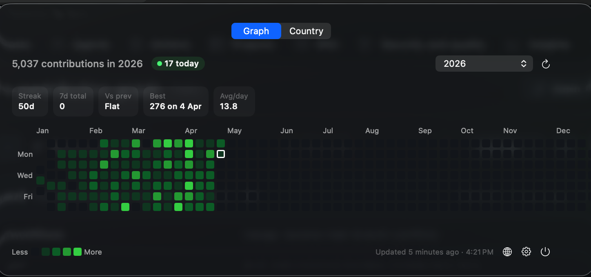
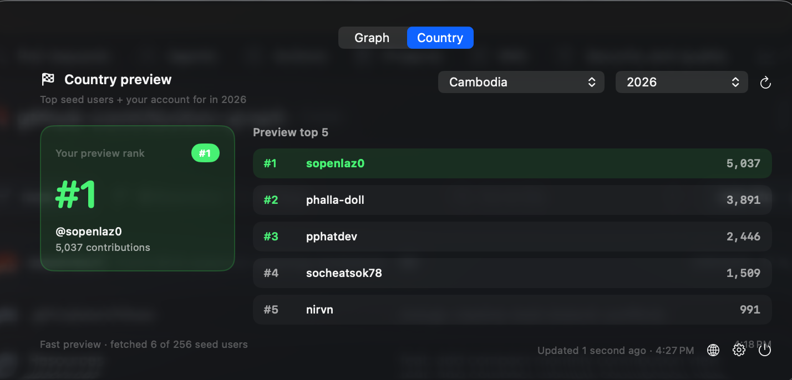

# GitHub Contributions

A minimal macOS menu bar app that shows your GitHub contribution graph. Glance at the menu bar to see today's count. Click to see the full grid.

**Zero config** — uses your existing `gh` CLI login. No tokens, no OAuth apps.


## Screenshots

### Contribution graph



### Country leaderboard preview



## Download & Install

1. Grab the latest `.dmg` or `.zip` from [Releases](../../releases)
2. If using the zip, unzip and drag `GitHubContributions.app` to `/Applications`
3. Remove the quarantine flag (macOS blocks unsigned downloaded apps):

```bash
xattr -cr /Applications/GitHubContributions.app
```

4. Open the app — it appears in your menu bar

**Prerequisite:** [GitHub CLI](https://cli.github.com/) installed and logged in:

```bash
brew install gh
gh auth login
```

## Features

- **Today's count in the menu bar** — see your number without clicking
- **Custom menu bar label** — show icon only, today's count, or your current streak
- **Full contribution graph** — 52 weeks, GitHub's exact colors
- **Automatic background refresh** — keep the menu bar fresh every 15 minutes
- **Daily reminder notification** — optional 6:00 PM reminder if you still have no contributions today
- **Dark mode** — proper GitHub dark palette, auto-switches
- **Time range selector** — last 12 months or a specific year
- **Insight chips** — current streak, trailing 7-day total, week-over-week delta, best day, average/day, and longest streak
- **Hover details + quick open** — hover any square for count + date, then click to open that day on GitHub
- **Today highlighted** — today's cell has a distinct border + green badge
- **Graph/Country switcher** — swap between your contribution graph and a fast country leaderboard preview
- **Zero config** — uses `gh auth token`, no tokens to paste
- **Menu bar only** — no dock icon, lightweight
- **Cached last view** — restores your last successful graph instantly on relaunch

## Build from Source

```bash
brew install xcodegen
make setup
make run
```

Or open in Xcode: `make open` → `Cmd + R`.

## How It Works

1. Runs `gh auth token` to grab your existing OAuth token
2. Fetches your username from the GitHub REST API
3. Fetches your contribution calendar via GraphQL (parameterized queries)
4. Renders the grid in a native macOS menu bar popover
5. Lets you switch between the graph panel and a country panel powered by committers.top seed lists plus batched GitHub GraphQL totals
6. Shows today's count in the menu bar label

If `gh` isn't installed or you're not logged in, the app shows the exact commands to run with copy buttons.

## Sign & Notarize

By default, the release build is ad-hoc signed. To properly sign and notarize so macOS doesn't block the app:

### 1. Find your signing identity

```bash
security find-identity -v -p codesigning
```

### 2. Sign the app

```bash
make sign IDENTITY="Developer ID Application: Your Name (TEAMID)"
```

### 3. Notarize with Apple (optional, removes all Gatekeeper warnings)

First, store your credentials once:

```bash
xcrun notarytool store-credentials "notary" \
  --apple-id you@email.com \
  --team-id ABCDE12345
```

Then notarize:

```bash
make notarize APPLE_ID="you@email.com" TEAM_ID="ABCDE12345"
```

### 4. Create a DMG

```bash
make dmg
```

## Creating a Release

Push a version tag to trigger the build:

```bash
git tag v1.1.0
git push origin v1.1.0
```

GitHub Actions builds on macOS 15 with Xcode 16.2, packages both a DMG and ZIP, and publishes a Release.

## Project Structure

```
├── Sources/
│   ├── App/
│   │   └── GitHubContributionsApp.swift   # Entry point, menu bar with today's count
│   ├── Views/
│   │   ├── ContributionGraphView.swift    # Grid, dark mode, hover, today highlight
│   │   ├── CountryLeaderboardView.swift   # Country rank card + top users list
│   │   ├── MenuBarView.swift              # Popover: graph, year dropdown, today badge
│   │   └── SettingsView.swift             # Account info, year picker, logout
│   ├── Models/
│   │   ├── ContributionModels.swift       # GitHub GraphQL response models
│   │   └── CountryLeaderboardModels.swift # Country ranking data models
│   ├── Services/
│   │   ├── CountryLeaderboardService.swift # committers.top + batched GraphQL rankings
│   │   ├── GitHubAuth.swift               # Reads token from gh CLI via Process
│   │   └── GitHubService.swift            # GitHub API (REST + GraphQL)
│   └── State/
│       └── AppState.swift                 # Auth, year selection, today's count
├── Resources/
│   ├── Info.plist
│   ├── GitHubContributions.entitlements
│   └── Assets.xcassets/
├── project.yml                            # XcodeGen spec
├── Makefile                               # setup, build, run, release, install
└── LICENSE
```

## Makefile

```bash
make setup     # Generate Xcode project
make build     # Build debug
make run       # Build and open the app
make release   # Build release .app (ad-hoc signed)
make sign      # Sign with Developer ID
make notarize  # Notarize with Apple
make dmg       # Create DMG installer
make install   # Copy to /Applications + clear quarantine
make clean     # Remove build artifacts
make open      # Open in Xcode
```

## License

[MIT](LICENSE)
